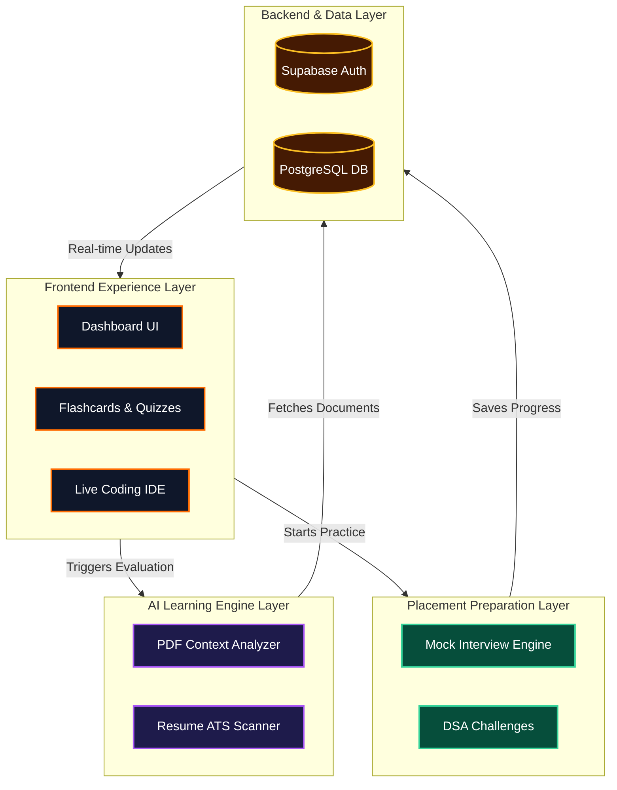

<div align="center">
  <!-- Customized Logo with Glow -->
  
  
  <br />
  
  # 🧠 PrepMind AI
  
  ### AI-Powered EdTech SaaS Platform

  [](https://react.dev/)
  [](https://vitejs.dev/)
  [](https://www.typescriptlang.org/)
  [](https://supabase.com/)
  [](https://tailwindcss.com/)
</div>

<br />

> **A modern, production-ready EdTech SaaS platform** combining intelligent study tools, placement preparation, and coding interview prep to help students excel in their exams and land their dream jobs.

## Features

### AI-Powered Learning
- **PDF Analysis**: Upload study materials and get AI-generated summaries
- **Smart Quizzes**: AI-generated quizzes and practice questions
- **Flashcards**: Interactive flashcards with spaced repetition
- **Exam Prep**: Viva questions and revision sheets

### Placement Preparation
- **Coding Interview Prep**: DSA practice with company-specific problems
- **Mock Interviews**: AI interviewer for technical and HR rounds
- **Resume Analyzer**: ATS-optimized resume suggestions
- **Progress Tracking**: Detailed analytics and learning insights

### Modern Dashboard
- **Comprehensive UI**: Built with React, TypeScript, and Tailwind CSS
- **Real-time Analytics**: Track study progress and achievements
- **Subscription Management**: Flexible pricing plans
- **User Settings**: Profile management and preferences

---

## 🏗️ 5-Layer Platform Architecture

Our system is engineered to scale from a single user study tool into a fully automated EdTech ecosystem.

### 1. Frontend Experience Layer
- **Intelligent Dashboard**: High-performance UI for tracking analytics, quizzes, and resumes.
- **Interactive Learning Spaces**: Dynamic flashcard decks and live coding environments.

### 2. AI Learning Engine Layer
- **PDF Intelligence**: Context-aware document summarization and insights.
- **Resume ATS Scanner**: Automated parsing and grading of user resumes.

### 3. Placement Preparation Layer
- **Mock Interview Engine**: Technical and HR round simulations.
- **DSA Coding Challenges**: Company-specific algorithmic problem sets.

### 4. Backend & Auth Layer
- **Supabase Authentication**: Secure role-based access and session handling.
- **PostgreSQL Database**: Relational storage for user profiles, analytics, and content.

### 5. Infrastructure Layer
- **Cloud Native Delivery**: Vercel-optimized hosting and automated deployment pipelines.
- **Future Workflow Automations**: Integrated n8n webhooks and triggers.

### 📊 Visual Architecture Diagram



---

## 💻 Animated Skills & Usage Architecture

<div align="center">
  <h3>Core Technologies</h3>
  
  
  
  
  
</div>

<br />

## Tech Stack

### Frontend
- **Framework**: React 18 with Vite
- **Language**: TypeScript
- **Styling**: Tailwind CSS
- **Components**: Custom component library with Lucide React icons
- **Routing**: React Router v6
- **State Management**: Zustand
- **HTTP Client**: Axios

### Backend & Database
- **Authentication**: Supabase Auth
- **Database**: Supabase PostgreSQL
- **API**: Supabase Realtime + REST API

### Deployment
- **Frontend**: Vercel-ready
- **Database**: Supabase Cloud
- **Future**: n8n for automation workflows

## Project Structure

```
src/
├── components/
│   ├── common/           # Reusable UI components
│   ├── auth/             # Authentication components
│   ├── dashboard/        # Dashboard layout
│   └── landing/          # Landing page sections
├── pages/                # Page components
├── services/             # API services
├── store/                # Zustand stores
├── types/                # TypeScript types
├── constants/            # Constants
├── hooks/                # Custom hooks
├── utils/                # Utility functions
└── App.tsx              # Main app component
```

## Getting Started

### Prerequisites
- Node.js 16+
- npm or yarn

### Installation

1. Clone the repository:
```bash
git clone <repository-url>
cd project
```

2. Install dependencies:
```bash
npm install
```

3. Set up environment variables:
```bash
cp .env.example .env
```

4. Update `.env` with your Supabase credentials:
```
VITE_SUPABASE_URL=your_supabase_url
VITE_SUPABASE_ANON_KEY=your_anon_key
```

### Development

Start the development server:
```bash
npm run dev
```

Visit `http://localhost:5173` in your browser.

### Build

Build for production:
```bash
npm run build
```

### Linting

Check code quality:
```bash
npm run lint
```

### Type Checking

Verify TypeScript types:
```bash
npm run typecheck
```

## Pages & Routes

### Public Pages
- `/` - Landing page
- `/login` - Login page
- `/signup` - Registration page

### Protected Dashboard Routes
- `/dashboard` - Main dashboard
- `/dashboard/notes` - AI Notes & Summaries
- `/dashboard/quizzes` - Quiz practice
- `/dashboard/flashcards` - Flashcard study
- `/dashboard/coding` - Coding interview prep
- `/dashboard/interviews` - Mock interviews
- `/dashboard/resume` - Resume analyzer
- `/dashboard/analytics` - Progress analytics
- `/dashboard/billing` - Subscription management
- `/dashboard/settings` - Account settings

## Database Schema

### Core Tables
- **users** - User profiles
- **uploads** - PDF/file uploads
- **quizzes** - Quiz records
- **quiz_questions** - Individual questions
- **flashcards** - Flashcard data
- **mock_interviews** - Interview records
- **resumes** - Resume uploads
- **subscriptions** - Subscription data
- **plans** - Subscription plans
- **transactions** - Payment records
- **analytics** - User activity tracking

All tables have Row Level Security (RLS) enabled for data privacy.

## Authentication

### Signup Flow
1. User enters email and password
2. Supabase Auth creates account
3. User profile created in `users` table
4. User redirected to dashboard
5. Default free plan assigned

### Login Flow
1. User enters credentials
2. Supabase Auth validates
3. Session stored in localStorage
4. User redirected to dashboard

### Protected Routes
All dashboard routes require authentication. Unauthenticated users are redirected to login.

## Component System

### Button Variants
- `primary` - Main CTA (brand gradient)
- `secondary` - Secondary action
- `outline` - Outlined button
- `ghost` - Text-only button

### Card Variants
- `default` - Standard white card
- `glass` - Glassmorphism effect
- `elevated` - Elevated with shadow

### Input Components
- Text inputs with validation
- Error and helper text support
- Icon support
- Disabled states

## Design System

### Colors
- **Brand**: Orange gradient (#FF6B00 - #FFA500)
- **Earth**: Warm neutrals for backgrounds
- **Navy**: Deep colors for text
- **Status**: Green (success), Red (error), Orange (warning)

### Typography
- **Headlines**: Bold, large sizes (4xl-6xl)
- **Body**: Regular 16px with 1.5 line height
- **Captions**: Small, muted colors

### Spacing
- Based on 4px grid system
- Consistent padding (4px, 8px, 12px, 16px, etc.)
- Generous whitespace for premium feel

### Border Radius
- xs: 8px
- sm: 12px
- md: 16px
- lg: 24px
- xl: 28px
- 2xl: 32px

## Responsive Design

Breakpoints (Tailwind default):
- Mobile: < 640px
- Tablet: 640px - 1024px
- Desktop: > 1024px

All pages are mobile-responsive with appropriate adjustments.

## 🚀 Future Enhancements

### Phase 2: Advanced Integrations
- [ ] **n8n Automation Workflows**: Automated email marketing, user retention loops, and data syncing.
- [ ] **Conversational AI Interviewers**: Voice-to-text integration for real-time realistic interview simulations.
- [ ] **Cloudinary Image Storage**: Seamless media handling.
- [ ] **Razorpay Payment Integration**: Indian-market optimized payment gateways.
- [ ] **Email Notifications**: Action-driven transactional emails.
- [ ] **Advanced Analytics**: Granular predictive scoring for placement readiness.

### Phase 3
- [ ] Admin dashboard
- [ ] User management
- [ ] Revenue analytics
- [ ] AI model integrations (OpenAI, Claude)
- [ ] Real-time features

### Phase 4
- [ ] Mobile app
- [ ] Team collaboration
- [ ] Advanced reporting
- [ ] API for partners

## Performance Optimizations

- Code splitting with React.lazy()
- Optimized bundle size (~109KB gzipped)
- CSS-in-JS for minimal stylesheet
- Image optimization ready
- Caching strategies in place

## Security

### Data Protection
- Row Level Security (RLS) on all tables
- Users can only access their own data
- Authentication required for dashboard
- HTTPS enforced in production

### Best Practices
- No sensitive data in client code
- Environment variables for secrets
- SQL injection prevention via Supabase
- CSRF protection built-in

## Deployment

### Vercel Deployment

1. Push code to GitHub
2. Connect repository to Vercel
3. Set environment variables in Vercel dashboard
4. Deploy automatically on push

### Environment Variables
```
VITE_SUPABASE_URL=https://xxxxx.supabase.co
VITE_SUPABASE_ANON_KEY=eyJhbGc...
```

## Browser Support

- Chrome (latest)
- Firefox (latest)
- Safari (latest)
- Edge (latest)

## Contributing

1. Create a feature branch
2. Make your changes
3. Test thoroughly
4. Submit a pull request

## License

MIT License - see LICENSE file for details

## Support

For issues and questions:
- GitHub Issues: [project-issues]
- Email: support@prepmind.ai

## Changelog

### v1.0.0 (Initial Release)
- Core platform features
- Authentication system
- Dashboard with all major features
- Database schema and RLS
- Production-ready build
